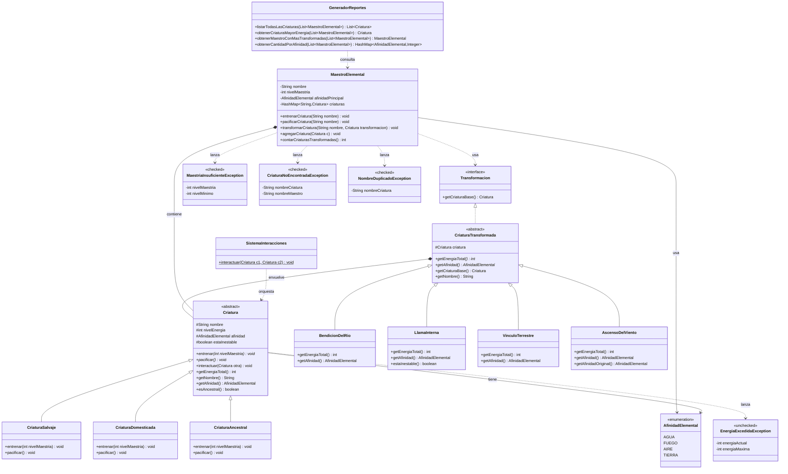

# Plan de Acción: Sistema de Gestión de Criaturas Elementales

---

## Diseño del Sistema

### Estructura de Paquetes

```
ar.edu.unlam.pbii
├── criaturas/
│   ├── AfinidadElemental.java (enum)
│   ├── Criatura.java (clase abstracta)
│   ├── CriaturaSalvaje.java
│   ├── CriaturaDomesticada.java
│   └── CriaturaAncestral.java
├── maestros/
│   └── MaestroElemental.java
├── transformaciones/
│   ├── Transformacion.java (interfaz o clase abstracta)
│   ├── CriaturaTransformada.java (decorador base)
│   ├── BendicionDelRio.java
│   ├── LlamaInterna.java
│   ├── VinculoTerrestre.java 
│   └── AscensoDelViento.java
├── interacciones/
│   └── SistemaInteracciones.java
├── reportes/
│   └── GeneradorReportes.java
├── excepciones/
│   ├── MaestriaInsuficienteException.java (checked)
│   ├── EnergiaExcedidaException.java (unchecked)
│   ├── CriaturaNoEncontradaException.java (checked)
│   └── NombreDuplicadoException.java (checked)
```

### Diagrama de Clases (Resumen)



### Comunicación entre Clases

1. **MaestroElemental ↔ Criatura**
   - El maestro mantiene un HashMap de criaturas
   - El maestro puede entrenar, pacificar y transformar criaturas
   - El maestro valida su nivel de maestría antes de entrenar

2. **Criatura ↔ Transformacion (Patrón Decorador)**
   - Las transformaciones envuelven criaturas
   - Múltiples transformaciones pueden apilarse
   - Cada transformación modifica `getEnergiaTotal()` y/o `getAfinidad()`

3. **Criatura ↔ Criatura (Interacciones)**
   - Las criaturas pueden interactuar entre sí
   - La lógica de interacción está en las propias criaturas
   - `SistemaInteracciones` orquesta las interacciones

4. **GeneradorReportes ↔ MaestroElemental**
   - El generador recibe una lista de maestros
   - Accede a las criaturas de cada maestro para generar reportes

---

## Fases de Implementación

### **FASE 1: Fundamentos del Sistema** (Base para todo)

#### Tareas:
1. Crear estructura de paquetes
2. Implementar `AfinidadElemental` (enum)
3. Implementar excepciones:
   - `MaestriaInsuficienteException` (checked)
   - `EnergiaExcedidaException` (unchecked)
   - `CriaturaNoEncontradaException` (checked)
   - `NombreDuplicadoException` (checked)
4. Implementar clase abstracta `Criatura`:
   - Atributos: nombre, nivelEnergia, afinidad, estaInestable
   - Métodos abstractos: `entrenar(int nivelMaestria)`, `pacificar()`
   - Método concreto: `getEnergiaTotal()`, getters/setters
5. Tests TDD para `Criatura` (estructura básica)

**Criterios de aceptación:**
- [X] Enum `AfinidadElemental` con 4 valores
- [X] Excepciones correctamente definidas
- [X] Clase abstracta `Criatura` compila
- [X] Tests básicos pasan

---

### **FASE 2: Tipos de Criaturas**

#### Tareas:
1. Implementar `CriaturaSalvaje`:
   - `entrenar()`: aumenta energía aleatoriamente (puede superar 200 → lanza `EnergiaExcedidaException`)
   - `pacificar()`: establece `estaInestable = false`
2. Implementar `CriaturaDomesticada`:
   - `entrenar()`: aumenta energía de forma estable (fórmula a definir)
   - `pacificar()`: siempre retorna sin cambios (nunca inestable)
3. Implementar `CriaturaAncestral`:
   - `entrenar()`: aumenta energía pero nunca baja de 100
   - `pacificar()`: lógica específica para ancestrales
   - Validación: energía mínima 100
4. Tests TDD para cada tipo de criatura:
   - Tests de entrenamiento
   - Tests de pacificación
   - Tests de excepciones

**Criterios de aceptación:**
- [X] Las 3 clases de criaturas implementadas
- [X] Comportamiento diferenciado en entrenamiento
- [X] Excepciones lanzadas correctamente
- [X] Cobertura de tests > 70% para criaturas

---

### **FASE 3: Maestros Elementales**

#### Tareas:
1. Implementar `MaestroElemental`:
   - Atributos: nombre, nivelMaestria (1-50), afinidadPrincipal, criaturas (HashMap)
   - `entrenarCriatura(String nombre)`: valida maestría, llama a `criatura.entrenar()`
   - `pacificarCriatura(String nombre)`: llama a `criatura.pacificar()`
   - `agregarCriatura(Criatura c)`: agrega al HashMap
   - `transformarCriatura(String nombre, Criatura transformacion)`: (preparar para Fase 4)
   - `contarCriaturasTransformadas()`: cuenta criaturas que implementan `Transformacion`
2. Validación de nivel de maestría:
   - Si nivel < umbral → lanza `MaestriaInsuficienteException`
   - Umbral a definir (ej: nivelMaestria < 10 para entrenar)
3. Tests TDD para `MaestroElemental`:
   - Tests de entrenamiento exitoso
   - Tests de excepción por maestría insuficiente
   - Tests de excepción por criatura no encontrada
   - Tests de excepción por nombre duplicado
   - Tests de pacificación
   - Tests de agregar criaturas
   - Tests de transformar criatura (preparación para Fase 4)

**Criterios de aceptación:**
- [X] Clase `MaestroElemental` completa
- [X] HashMap de criaturas funcionando
- [X] Validación de maestría implementada
- [X] Tests pasan con clases reales de Fase 2

---

### **FASE 4: Transformaciones (Patrón Decorador)**

#### Tareas:
1. Diseñar interfaz/clase base `Transformacion`:
   - Método `getCriaturaBase()`: Criatura
   - Nota: Las transformaciones implementan `Criatura` y `Transformacion` (patrón Decorador)
2. Implementar `CriaturaTransformada` (decorador base):
   - Envuelve una `Criatura`
   - Delega métodos básicos
3. Implementar transformaciones concretas:
   - `BendicionDelRio`: duplica energía (máx 180)
   - `LlamaInterna`: +30 si fuego, sino inestable
   - `VinculoTerrestre`: garantiza energía mínima 50
   - `AscensoDelViento`: convierte a AIRE temporalmente
4. Implementar apilado de transformaciones:
   - Una criatura puede tener múltiples transformaciones
   - El orden importa
5. Integrar con `MaestroElemental.transformarCriatura()`
6. Tests TDD para transformaciones:
   - Tests individuales de cada transformación
   - Tests de apilado
   - Tests de orden de aplicación

**Criterios de aceptación:**
- [X] Patrón decorador implementado correctamente
- [X] Las 4 transformaciones funcionan
- [X] Apilado de transformaciones funciona
- [X] Tests completos

---

### **FASE 5: Interacciones entre Criaturas**

#### Tareas:
1. Implementar lógica de interacción en `Criatura`:
   - Método `interactuar(Criatura otra)`
2. Implementar reglas de interacción:
   - Misma afinidad → ambas +10 energía
   - Opuestas (agua-fuego, aire-tierra) → ambas inestables
   - Si una es ancestral → ancestral +20, otra -15 (mín 0)
   - Si ambas son ancestrales → ambas dominan (ambas +20)
3. Implementar `SistemaInteracciones` (orquestador):
   - Método estático `interactuar(Criatura c1, Criatura c2)`
4. Tests TDD para interacciones:
   - Test: misma afinidad
   - Test: afinidades opuestas
   - Test: una ancestral
   - Test: ambas ancestrales
   - Test: combinaciones con transformaciones
   - Test: SistemaInteracciones (orquestador)

**Criterios de aceptación:**
- [ ] Todas las reglas de interacción implementadas
- [ ] Jerarquía de clases respeta SRP y OCP
- [ ] Tests completos

---

### **FASE 6: Reportes para el Consejo**

#### Tareas:
1. Implementar `GeneradorReportes`:
   - `listarTodasLasCriaturas(List<MaestroElemental> maestros)`: List<Criatura>
   - `obtenerCriaturaMayorEnergia(List<MaestroElemental> maestros)`: Criatura
   - `obtenerMaestroConMasTransformadas(List<MaestroElemental> maestros)`: MaestroElemental
   - `obtenerCantidadPorAfinidad(List<MaestroElemental> maestros)`: HashMap<AfinidadElemental, Integer>
2. Lógica de detección de criaturas transformadas:
   - Identificar si una criatura tiene transformaciones aplicadas
3. Tests TDD para reportes:
   - Test: listar todas las criaturas (incluye caso vacío)
   - Test: criatura con mayor energía (incluye transformaciones y caso vacío)
   - Test: maestro con más transformadas (incluye empate y caso vacío)
   - Test: cantidad por afinidad (incluye transformaciones y caso vacío)

**Criterios de aceptación:**
- [ ] Los 4 reportes implementados
- [ ] Lógica correcta en todos los casos
- [ ] Tests completos

---

### **FASE 7: Integración y Refinamiento**

#### Tareas:
1. Integrar todas las fases
2. Verificar cobertura de tests (mínimo 70%)
3. Refactorizar código según principios SOLID
4. Validar nombres de clases/métodos (UpperCamelCase, lowerCamelCase)
5. Revisar manejo de excepciones
6. Documentar decisiones de diseño
7. Crear casos de prueba end-to-end

**Criterios de aceptación:**
- [ ] Todo el sistema funciona integrado
- [ ] Cobertura de tests ≥ 70%
- [ ] Código limpio y bien estructurado
- [ ] Principios SOLID aplicados

---

## Estrategia de Testing (TDD)

### Reglas:
1. **Escribir tests ANTES de implementar** (TDD puro)
2. **Cobertura mínima:** 70%
3. **Usar JUnit 4**
4. **Tests deben ser independientes y repetibles**

### Estructura de Tests:
```
test/
└── ar/
    └── edu/
        └── unlam/
            └── pbii/
                ├── criaturas/
                │   ├── AfinidadElementalTest.java
                │   ├── CriaturaTest.java
                │   ├── CriaturaSalvajeTest.java
                │   ├── CriaturaDomesticadaTest.java
                │   ├── CriaturaAncestralTest.java
                │   └── CriaturaInteraccionesTest.java
                ├── excepciones/
                │   ├── EnergiaExcedidaExceptionTest.java
                │   └── MaestriaInsuficienteExceptionTest.java
                ├── maestros/
                │   └── MaestroElementalTest.java
                ├── transformaciones/
                │   ├── CriaturaTransformadaTest.java
                │   ├── BendicionDelRioTest.java
                │   ├── LlamaInternaTest.java
                │   ├── VinculoTerrestreTest.java
                │   └── AscensoDelVientoTest.java
                ├── interacciones/
                │   └── SistemaInteraccionesTest.java
                └── reportes/
                    └── GeneradorReportesTest.java
```

---

## Decisiones de Diseño Definidas

### Fórmula de Entrenamiento:

**Fórmula base:** `energia += nivelMaestria * factorTipo`

- **Criaturas Salvajes:**
  - Aumento aleatorio: `energia += random(1, 200)`
  - Puede superar 200 → lanza `EnergiaExcedidaException` (unchecked)
  
- **Criaturas Domesticadas:**
  - Factor fijo: `factorTipo = 2`
  - Aumento estable y predecible
  
- **Criaturas Ancestrales:**
  - Factor fijo: `factorTipo = 3`
  - Si el parámetro `nivelMaestria` recibido en `entrenar(int nivelMaestria) > 40` → entrenamiento extremo → criatura se vuelve inestable
  - Validación: energía nunca baja de 100

### Umbral de Maestría:

- **Nivel mínimo para entrenar:** `nivelMaestria >= 10`
- Si el maestro tiene nivel < 10 → lanza `MaestriaInsuficienteException` (checked)

### Aumento Aleatorio en Criaturas Salvajes:

- **Rango:** `energia += random(1, 200)`
- **Decisión final:** Usar `random(1, 200)` para simular comportamiento impredecible de criaturas salvajes

### Entrenamientos Extremos (Ancestrales):

- **Condición:** El parámetro `nivelMaestria` recibido en `entrenar(int nivelMaestria) > 40`
- **Efecto:** La criatura ancestral se vuelve inestable (`estaInestable = true`)
- **Justificación:** Las criaturas ancestrales son sensibles a entrenamientos muy intensos
- **Nota:** El nivel de maestría proviene del atributo `nivelMaestria` del `MaestroElemental` cuando se entrena a través de `maestro.entrenarCriatura()`. La criatura ancestral evalúa el parámetro recibido, no consulta directamente al maestro.

### Pacificación Polimórfica:

- **CriaturaSalvaje:** `estaInestable = false`
- **CriaturaDomesticada:** No hace nada (nunca están inestables, método vacío)
- **CriaturaAncestral:** `estaInestable = false` + validación de energía mínima (100)

---
### Estructura de Branches Propuesta:
```
main
├── feat/tdd-01
├── feat/tdd-02
├── feat/phase-01
├── feat/phase-02
├── feat/phase-03
├── feat/phase-04
├── feat/phase-05
├── feat/phase-06
└── feat/phase-07
```
